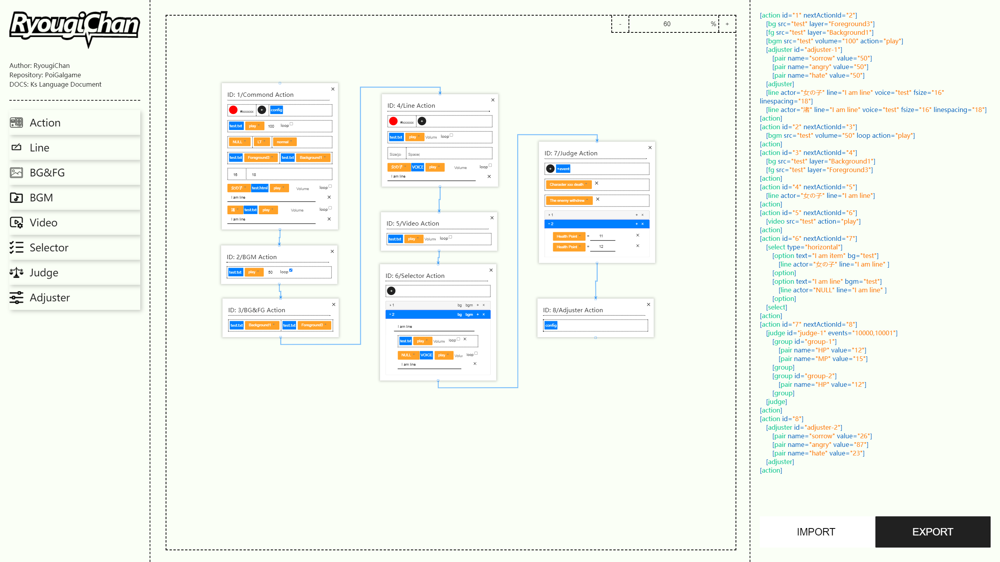
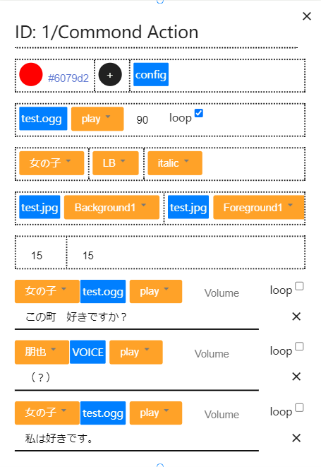
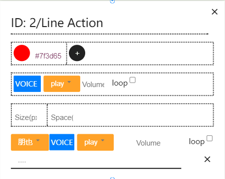
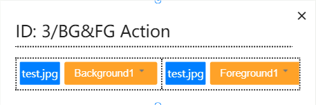
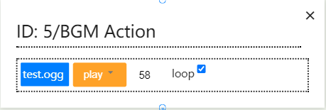
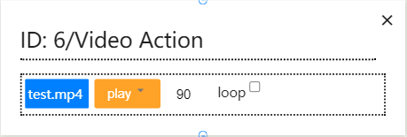
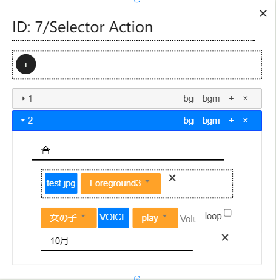
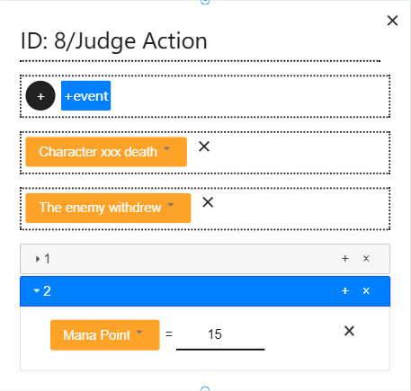
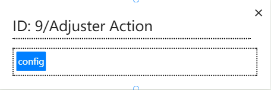
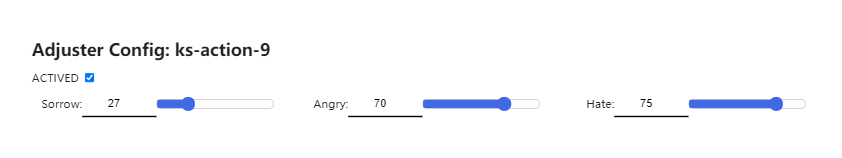

# KsEditor

## Overview



**KsEditor** is a JavaScript-based visual editor for [KsScript language](#). All you need is drag/create components to let JavaScript generate code autoly.

## Requirements

### Browser Requirement

This editor developed using a quantity of new feature of **ES6+**(ECMAScript 6.0 and higher version).
So we highly recommend using lastest [Google Chrome](https://chrome.google.com) browser.
Otherwise, We are not responsible for anything strange that happens `（＞人＜；）`.

### Priority Requirement

You must allow your browser to download multiple files at the same time when using the **Export** feature.

### Monitor Resolution Requirement

This editor developed base on monitor with resolution `1920*1080` and `2560*1440`. Therefore it's better to use the  two resolutions for best experience.

## Components Introduction

| Component | Introduction | Ks Support | Example |
| --------- | ------------ | :--------: | ------- |
| Common Action | A action contains most of widgets, including `Line`, `BGM`, `BG`, `FG`, `Adjuster` | YES |  |
| Line Action | A action to configure lines of character. Properties `font color`, `font size`, `line spacing` can be configured here | YES |  |
| BG/FG Action | A action to configure background image and forground image(Picture of character in most case) | YES |  |
| BGM Action | A action to configure background music | YES |  |
| Video Action | A action to configure and play video | NO |  |
| Selector Action | Configuring a select action to provide several choices for player. In every select item, you can configure `BG`, `BGM`. Also, you can provide special `Line` contents for this select | YES |  |
| Judge Action | A action to trigger events specified by `Event ID` according to judge conditions set(can be multiple) | YES |  |
| Adjuster Action | Manually adjust some value via this action | YES |   |

## Generated Code Example

The following is a example of generated code

```r
[chs]
    [action id="1" nextActionId="2" roundId="1"]
        [bg src="test" layer="Background1"]
        [fg src="test" layer="Foreground1"]
        [bgm src="test" volume="90" loop action="play"]
        [adjuster id="adjuster-1"]
            [pair name="Sorrow" value="1"]
            [pair name="Angry" value="-1"]
            [pair name="Hate" value="1"]
            [pair name="Swordcraft" value="0"]
            [pair name="Mount" value="0"]
            [pair name="Wrestling" value="0"]
        [adjuster]
        [line actor="女の子" line="おはようございます" voice="test" fsize="16" linespacing="18" fcolor="0xe75050ff"]
        [line actor="渚" line="おはよう" voice="test" fsize="16" linespacing="18" fcolor="0xe75050ff"]
    [action]
    [action id="2" nextActionId="3" previousActionId="1" roundId="1"]
        [bg src="test" layer="Background1"]
        [fg src="test" layer="Background1"]
    [action]
    [action id="3" nextActionId="4" previousActionId="2" roundId="2"]
        [line actor="女の子" line="いい天気ですね" voice="test" fcolor="0x34f948ff"]
        [line actor="渚" line="はい、とても気持ちです" voice="test" fcolor="0x34f948ff"]
    [action]
    [action id="4" nextActionId="5" previousActionId="3" roundId="2"]
        [bgm src="test" loop action="play"]
    [action]
    [action id="5" nextActionId="6" previousActionId="4" roundId="2"]
        [video src="test" volume="100" action="play"]
    [action]
    [action id="6" nextActionId="7" previousActionId="5" roundId="3"]
        [select type="horizontal"]
            [option text="通路１" bg="test" bgm="test"]
                [adjuster id="adjuster-2"]
                    [pair name="Sorrow" value="2"]
                    [pair name="Angry" value="0"]
                    [pair name="Hate" value="0"]
                    [pair name="Swordcraft" value="0"]
                    [pair name="Mount" value="0"]
                    [pair name="Wrestling" value="0"]
                [adjuster]
                [line actor="渚" line="君は誰？" voice="test"]
                [line actor="朋也" line="大丈夫ですか？" voice="test"]
            [option]
            [option text="通路２" bg="test" bgm="test"]
                [adjuster id="adjuster-3"]
                    [pair name="Sorrow" value="-2"]
                    [pair name="Angry" value="0"]
                    [pair name="Hate" value="0"]
                    [pair name="Swordcraft" value="0"]
                    [pair name="Mount" value="0"]
                    [pair name="Wrestling" value="0"]
                [adjuster]
                [line actor="朋也" line="誰？" voice="test"]
                [line actor="女の子" line="...." voice="test"]
            [option]
        [select]
    [action]
    [action id="7" nextActionId="8" previousActionId="6" roundId="3"]
        [judge id="judge-1"]
            [event evtid="10001"]
                [adjuster id="adjuster-4"]
                    [pair name="Sorrow" value="4"]
                    [pair name="Angry" value="0"]
                    [pair name="Hate" value="0"]
                    [pair name="Swordcraft" value="0"]
                    [pair name="Mount" value="0"]
                    [pair name="Wrestling" value="0"]
                [adjuster]
            [event]
            [event evtid="10002"]
                [adjuster id="adjuster-5"]
                    [pair name="Sorrow" value="0"]
                    [pair name="Angry" value="0"]
                    [pair name="Hate" value="-2"]
                    [pair name="Swordcraft" value="0"]
                    [pair name="Mount" value="0"]
                    [pair name="Wrestling" value="0"]
                [adjuster]
            [event]
            [group id="group-1"]
                [pair name="HP" value="50"]
            [group]
            [group id="group-2"]
                [pair name="MP" value="50"]
                [pair name="HP" value="20"]
            [group]
        [judge]
    [action]
    [action id="8" nextActionId="9" previousActionId="7" roundId="4"]
        [adjuster id="adjuster-6"]
            [pair name="Sorrow" value="-7"]
            [pair name="Angry" value="6"]
            [pair name="Hate" value="6"]
            [pair name="Swordcraft" value="27"]
            [pair name="Mount" value="14"]
            [pair name="Wrestling" value="-16"]
        [adjuster]
    [action]
    [action id="9" previousActionId="8" roundId="4"]
        [events id="events-1"]
            [event evtid="10002"]
                [adjuster id="adjuster-7"]
                    [pair name="Sorrow" value="4"]
                    [pair name="Angry" value="6"]
                    [pair name="Hate" value="0"]
                    [pair name="Swordcraft" value="0"]
                    [pair name="Mount" value="0"]
                    [pair name="Wrestling" value="0"]
                [adjuster]
            [event]
            [event evtid="10000"]
                [adjuster id="adjuster-8"]
                    [pair name="Sorrow" value="15"]
                    [pair name="Angry" value="0"]
                    [pair name="Hate" value="0"]
                    [pair name="Swordcraft" value="0"]
                    [pair name="Mount" value="0"]
                    [pair name="Wrestling" value="0"]
                [adjuster]
            [event]
        [events]
    [action]
[che]

```

## Translating Ks Code to Unity Asset

Here we provide a way to achieve this goal by using scene named [Translator](../Assets/Scene/Translator.unity).

1. Usage of **`スクリプト翻訳`**

    1. Input file name(located in Chapter.ks folder and with extension .ks) or full path.
    2. Click button **`スクリプト翻訳`**
    3. The unity asset will be generated in the folder **[Chapter](../Resources/Chapter)**

2. Usage of **`すべてを翻訳`**

    By clicking this button, all you should do is wait. Then the unity asset will be generated in the folder **[Chapter](../Resources/Chapter)** or the folder of current file seleted

## Copyright

Copyright © [RyougiChan](https://github.com/RyougiChan). All rights reserved.
